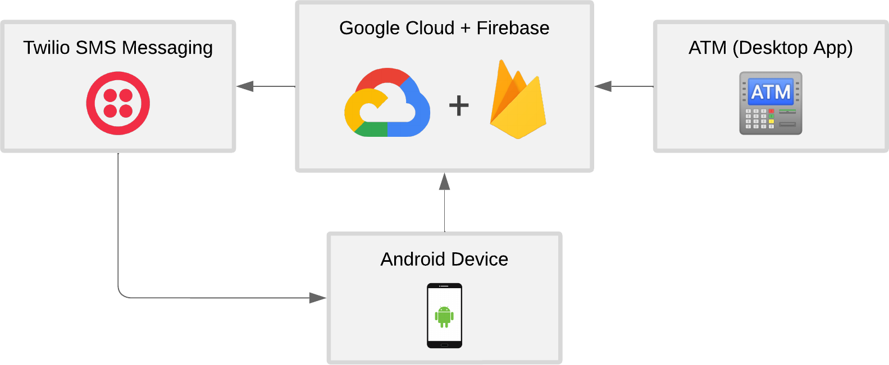
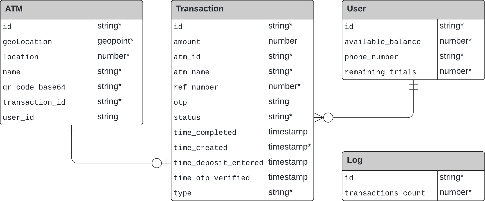
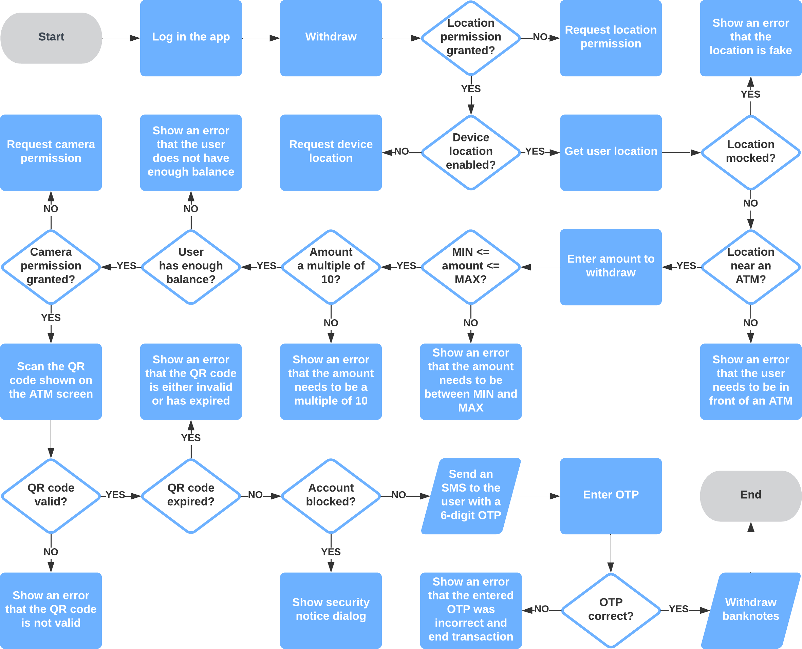
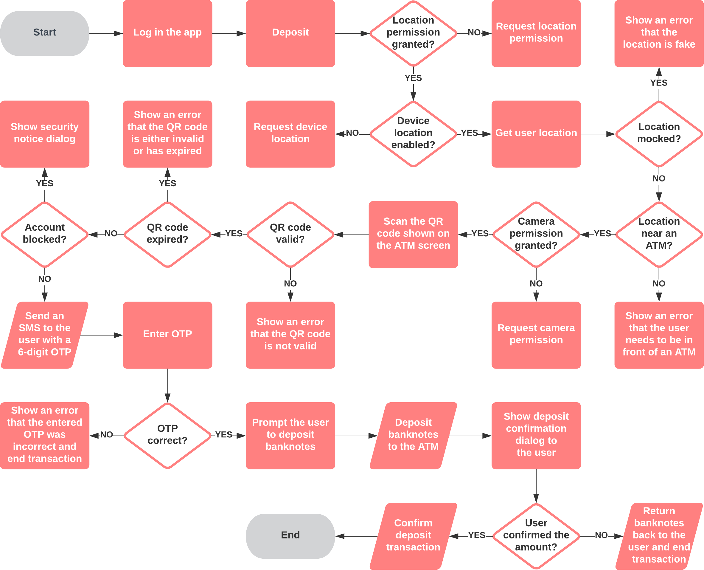
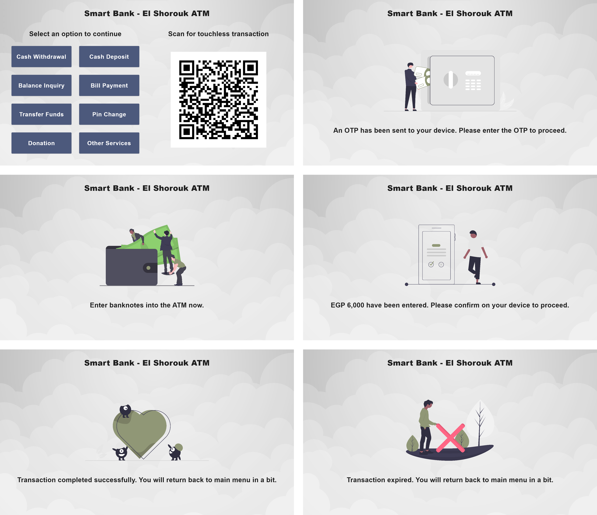
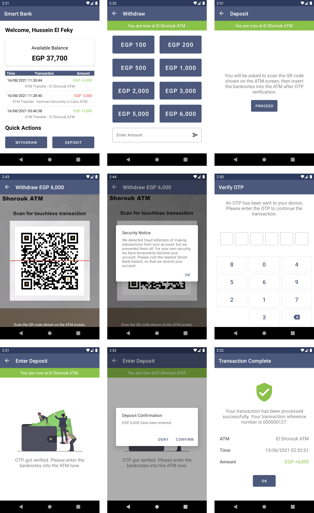

# Touchless Secure QR-based ATM System

This project implements a new touchless secure QR-based ATM system instead of the traditional card-based ATM system, by scanning a QR code shown on the ATM screen to perform withdrawal or deposit transactions without needing to hold the ATM card or touch the ATM touchscreen or keypads at all, minimizing the risk of spreading contagious diseases such as the COVID-19 pandemic while taking various security countermeasures into consideration.

The following sections summarize the system's methodology, but to learn more, you can read [my published paper on Springer](https://doi.org/10.1007/978-3-031-20601-6_29) from the [Proceedings of the 8th International Conference on Advanced Intelligent Systems and Informatics 2022](https://link.springer.com/book/10.1007/978-3-031-20601-6).

## Purpose

The purpose of the system is to make ATM transactions more secure and lucid as well as to decrease the spread of contagious diseases caused by the human interaction with the ATM as much as possible.

## Methodology

A new touchless ATM system is built, in which a QR code is used as an alternative to the physical ATM card-based authentication. A QR code is used for authenticating with the ATM, and the device location and a 6-digit long OTP are used for validating the transaction. This system would be a new feature incorporated in the existing ATMs and banks’ mobile app, thereby eliminating the need for carrying ATM cards but also keeping the traditional card-based ATM system in case the user would like to perform transactions without the mobile app.

### ATM Systems 2FA Comparison

| Approach | Knowledge | Possession | Inherence |
|-|-|-|-|
| Card-based | Card PIN | Card | None |
| QR-based | Account Password | Device (OTP) | None |

### System Architecture

The proposed system consists of 3 main components, the desktop app that is used to show the ATM content, the bank’s Android app that is used to perform touchless transactions from, and the cloud server that is used to manage transactions and link them to the user’s bank account when a transaction is underway, taking various possible security countermeasures into consideration.

The following image shows the proposed system architecture. The cloud server uses Firebase as the backend services provider, which uses Google Cloud to store data and execute server-side logic. This includes Firebase Authentication to authenticate the users using email and password, Cloud Firestore to store the ATMs and users data, and Cloud Functions to perform some business logic. The Android and desktop apps are built with Kotlin following the Model-View-Intent (MVI) architecture for its great maintainability in view state management and error handling, while the cloud functions are built with JavaScript. Twilio messaging services are also used to send SMS messages to the user whenever required; this includes the OTP messages as well as warnings of fraud attempts.

### Database Structure

Cloud Firestore is used to store ATMs data and all users’ transactions due it its high scalability over other types of databases by being a NoSQL-based database. There are 3 parent collections, namely `atms`, `users`, `logs`, and one subcollection inside users collection called `transactions`.

### Withdrawal Workflow

After the user selects an amount to withdraw, they first scan the QR code shown on the ATM screen from the ATM main menu, then they will be prompted to enter the OTP on their mobile device, after which the banknotes will be withdrawn and the transaction will then be completed.

### Deposit Workflow

Similarly, after the user proceeds to deposit on their mobile device, they first scan the QR code shown on the ATM screen from the ATM main menu, then they will be prompted to enter the OTP on their mobile device, after which they will be prompted to insert banknotes into the ATM. Once the user inserts banknotes, they will be prompted to confirm the deposited amount on their mobile device. On confirmation, the transaction will be completed successfully, while on denial, the ATM will first return back the banknotes to the user, then the transaction will be completed.

## Screenshots

The following images are some screenshots taken from the developed system.

### Desktop App

### Android App

